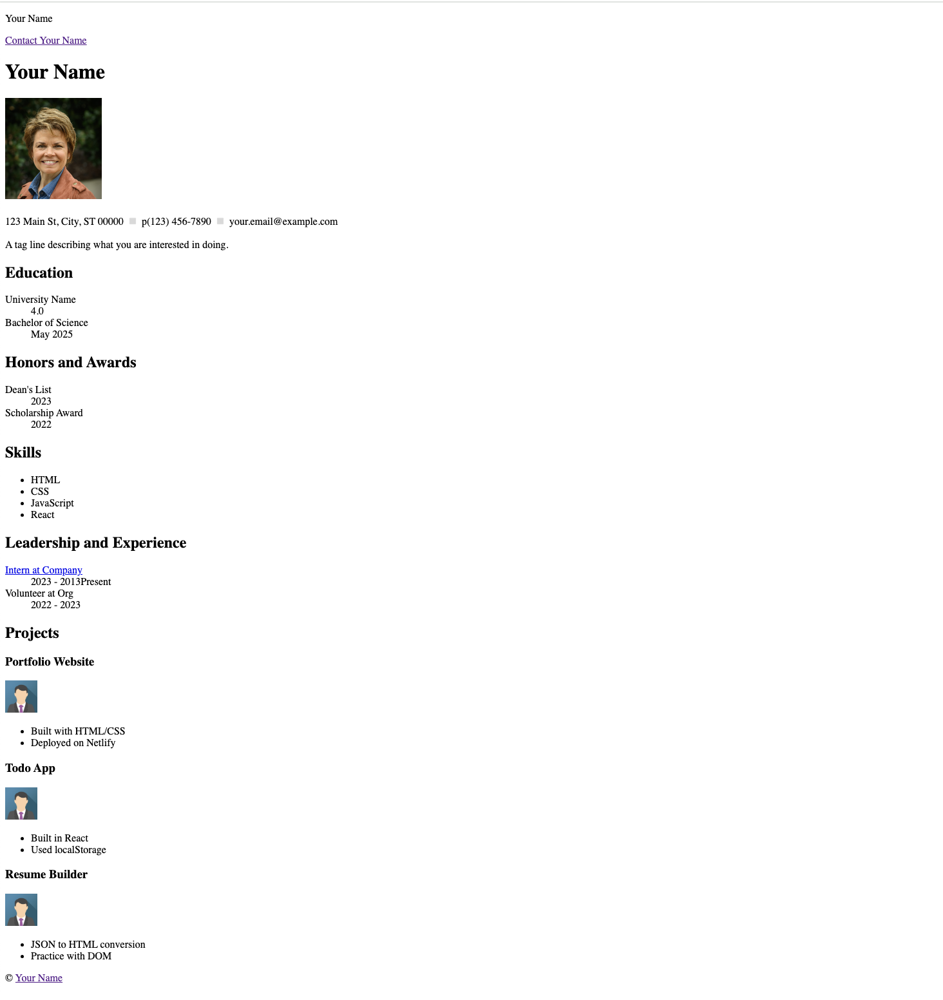

# HTML Resume Assignment

In this assignment, you will create a resume website using HTML. The resume includes two pages:

- `index.html`: A semantically structured resume
- `contact.html`: A contact form with submission functionality

You will use the provided `resume.json` file as your source of content. This assignment is designed to help you practice HTML structure and prepare for a future React assignment that uses the same JSON data.

---

## Provided Files

- `resume.json`: A JSON template where you'll enter your name, education, experience, and other content.  This is the data that becomes the content of your resume.  ie. The tests will expect the data in resume.json to match the data in your html resume.

---
## Part 1: Project Setup

- Create a new file, `index.html` and add the html5 boilerplate.
- Create a new file, `contact.html` and add the html5 boilerplate.
- inside the `images` folder, put a jpg image of yourself (a headshot).
- Change the title of both pages to include *your_name*.

## Part 2: Build `index.html`

Create a semantically structured resume based on the content in `resume.json`.

### 🧭 Step-by-step Instructions

1. Create a **Navigation section (`<nav>`)**
   - Include your name and a link to `contact.html` labeled `"Contact Your Name"`. Create:
      - a paragraph (`
`) with content: *your_name*
      - a paragraph with content: Contact *your_name*
      - make the `Contact your_name` text a link to `contact.html.  Use a relative path.

2. Create a **Profile information**
   - Include a headshot and contact info in this section. Include:
      - an `<h1>` heading with content *your_name*
      - Your headshot, sized appropriately, using an `` tag and a relative path (`images/headshot.jpg`) and alt text.
      - Add a paragraph to list your address, phone number, and email.
      - Add an appropriate character entity between the address, phone and email.
      - Add a paragraph containing sentence or two describing your interests and goals.

3. Add a horizontal rule.

4. Create an **Education section ( `<section>` )**
   - Create the heading and  educational accomplishments.  Include:
      - an `<h2>` heading with content: *Education*.
      - a `<dl>` list with these elements:
            - School name → GPA
            - Degree → Graduation Date

5.  Create an **Honors and Awards section ( `<section>` )**
   - Create the heading and list of honors and awards.  Include:
      - an `<h2>` heading with content: *Honors and Awards*.
      - a `<dl>` list of honors and awards(`<dt>`) with appropriate dates(`<dd>`):
            - Honor or Award → date

6. Create a **Skills section ( `<section>` )** 
   - Create the heading and list of skills.  Include:
      - an `<h2>` heading with content: *Skills*.
      - an unordered list `<ul>` of skills (languages)

7.  Create an **Leadership and Experience section ( `<section>` )**
   - Create the heading and list of leadership/experience.  Include:
      - an `<h2>` heading with content: *Leadership and Experience*.
      - a `<dl>` list of leadership/experience/job (`<dt>`) with appropriate dates(`<dd>`):
      - Make at least one `<dt>` a link to the company website using an **absolute URL**.   

9.  Create an **Projects section ( `<section>` )**
   - Create the heading and information on at least 3 projects.  Include:
      - an `<h2>` heading with content: *Projects*.
      - For each project, wrap the following elements in `
` tags
         - an `<h3>` heading with the project name as the content
         - an ``, appropriately sized, that represents the project (relative path, alt text)
         - an `<ul>` with bullet points describing the project

10. Create a **Footer section (`<footer>`)**
    - Use `<footer>` semantic tags and include:
      - the copyright symbol 
      - *your name* 
      - make *your name* a link to `contact.html` using a relative path
      - a font awesome *linked In* icon
      - make the LinkedIn icon a link with to your LinkedIn profile.  Make this open in a new tab.

---
* If you do not have sufficient content for one of the sections such as projects or honors, please add projects, etc. that you hope or plan to complete in the near future. In other words, fill in each content section with appropriate material. Projects can include 1302 projects, etc.

##  Part 3: Build `contact.html`

Copy the `nav` and `footer` sections from the `index.html page and add a form for user input.

### 🧭 Step-by-step Instructions

1. Create a **Navigation section (`<nav>`)**
   - You may copy the `nav` section from the index.html page but change the link destination to go to `index.html` and change `"Contact *Your Name*"` to `"About *Your Name*"`. 

2. Create a **Profile info**
  - Include name and contact info in this section:
      - add an `<h1>` heading with content *your_name*
      - add a paragraph with the content your address, phone number, and email
      - add an appropriate character entity between the address, phone number and email.

3. Add a horizontal rule.

4. Creata a **Form Section (`<section>`)**
   - Include a `<form>` with:
     - `method="POST"`
     - `action="https://formsubmit.co/your_unique_form_id"` (Use formsubmit.io to securely store your email and forward the form data to you.)
   - Include form fields:
     - Text input for name (required)
     - Email input (required)
     - Textarea for message
     - Submit button

5. Create a **Footer section (`<footer>`)**
   - Same as the `<footer>` section on index.html but change the link destination to `index.html` with a relative path. The link to your LinkedIn profile is the same.

---
Here's a screenshot of a sample `index.html` page:

Here's a screenshot of a sample `contact.html` page:

### Testing locally

After you have completed the index.html and contact.html files.  You may run the test scripts locally by:

1. Install the tools by running:

   `npm install`

2. Run the test scripts:
   
   `npm test`
